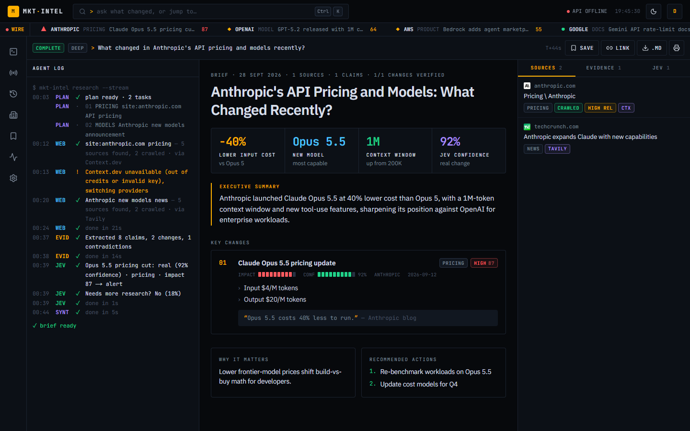
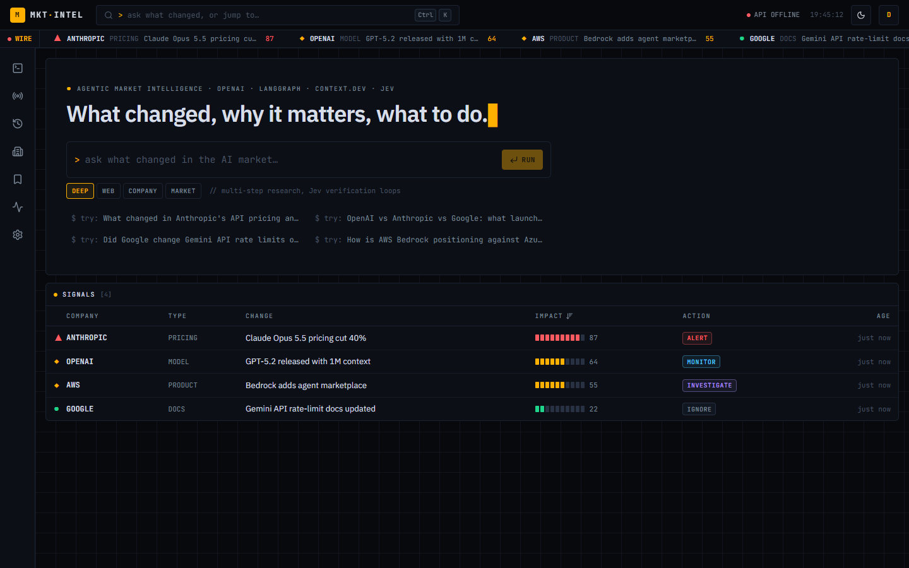
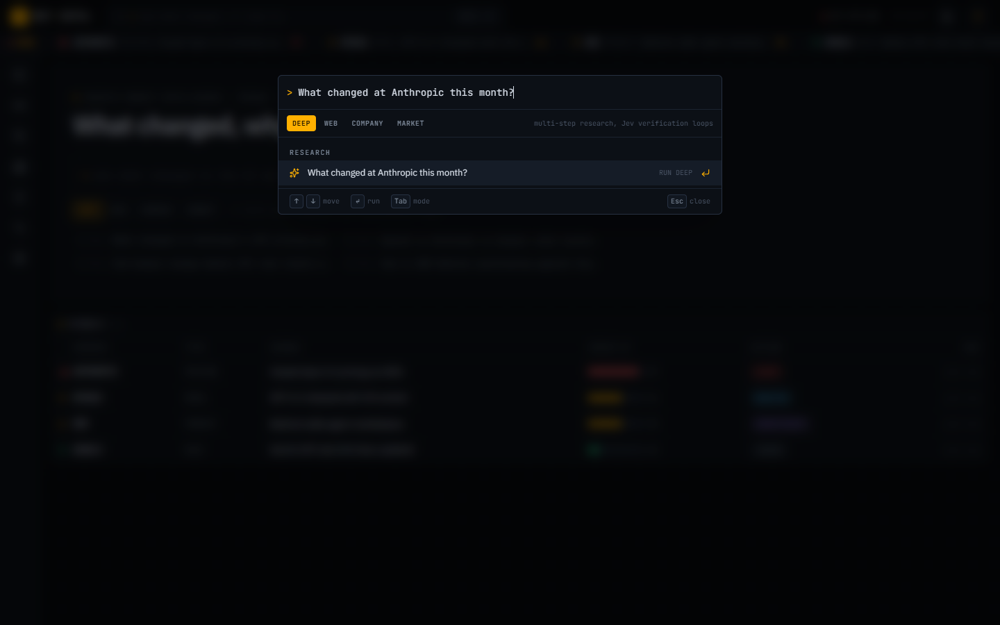
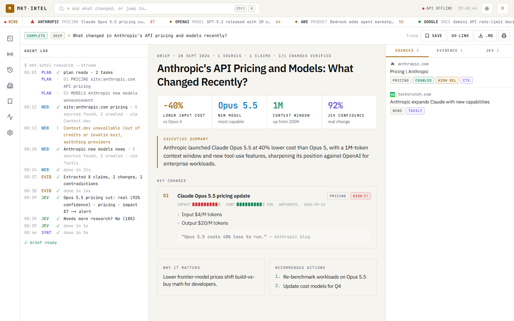
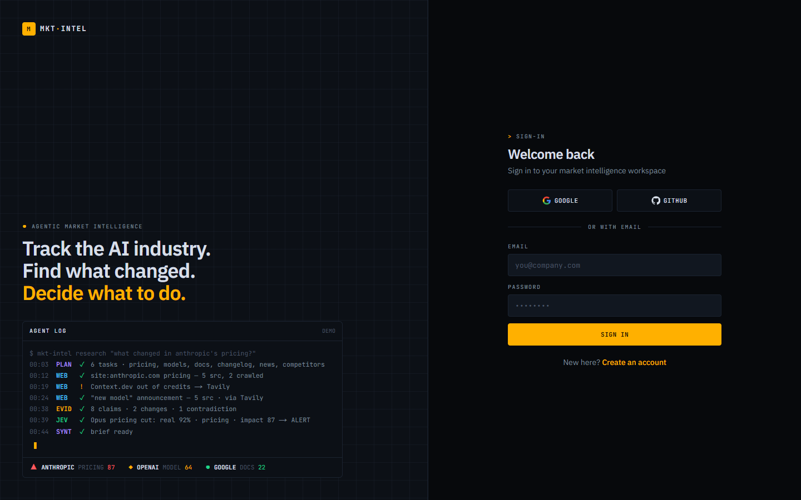

# MKT·INTEL — Agentic Market Intelligence

**Track the AI industry. Find what changed. Understand the impact. Decide what to do.**

Ask a question like *"What changed in Anthropic's API pricing and models recently?"* A team of agents plans the research, searches and crawls the live web, extracts evidence, has **Jev** make typed, confidence-scored decisions about every change, loops back when evidence is weak, and hands you a sourced executive brief. You watch it happen in a terminal-style interface.



## Features

- **Four research modes.** *Deep* (multi-step, with Jev verification loops), *Web* (fast single pass), *Company* (one company in depth) and *Market* (competitive comparison).
- **Live agent log.** Every plan step, search, crawl, provider switch and decision streams over SSE.
- **Typed decisions.** For each change, Jev answers four questions: *is it real?* (probability), *which type?* (a probability for each type), *how big is the impact?* (0–100) and *how strong is the evidence?* It also returns who is affected. The app then maps the decision to **alert / investigate / monitor / ignore**.
- **A brief with receipts.** KPI tiles, executive summary, key changes with impact and confidence meters, quotes, contradictions and every source.
- **Web data that keeps working.** Context.dev is tried first, then Tavily, then Firecrawl, with a credit breaker that skips a provider once it runs out.
- **System monitoring.** Provider health, live credit balances, fallback routing and per-run usage, with optional LangSmith tracing.
- **Signals, watchlist and history.** Verified changes across all runs, ranked by impact, with an auto-discovered company watchlist.
- **Bring your own keys and models.** Paste your own OpenAI, Anthropic, Gemini or OpenRouter key and choose a **fast** model (planning and extraction) and a **strong** model (the brief) from the provider's live model list. You can also add your own Context.dev, Tavily or Firecrawl keys. Your keys are encrypted at rest and tried first, with the platform keys as fallback. An OpenRouter key unlocks every model plus Jev. Without one, decisions run on an **LLM decision agent** that uses your key and produces the same typed outputs, so Jev isn't required.
- **Keyboard first.** `Ctrl K` command palette, `1–7` to navigate, `j/k` to move through lists. Dark "terminal" and light "paper" themes.

| | |
|---|---|
|  |  |
|  |  |

## Stack

| Layer | Tech |
|---|---|
| Frontend | Next.js 16 (App Router), React 19, Tailwind CSS v4, lucide icons, deployed on **Vercel** |
| API | FastAPI with SSE (`sse-starlette`), deployed on **Railway** |
| Orchestration | **LangGraph** state graph, LangChain `ChatOpenAI` with structured output |
| Reasoning | LLM gateway: platform OpenAI direct (`gpt-4o-mini` fast / `gpt-4.1` strong), or the user's own OpenAI / Anthropic / Gemini / OpenRouter key and models |
| Decisions | **Jev** (`typesafe/jev-1.13`) through the OpenRouter Decisions API, or the LLM decision agent (same output shapes) |
| Web data | **Context.dev**, falling back to **Tavily** and then **Firecrawl** |
| Auth & DB | **InsForge**: email + code, Google and GitHub OAuth, Postgres with row-level security |
| Observability | Built-in `/system` meters, LangSmith (optional) |

## How it works

1. **Plan.** OpenAI identifies the companies and their official domains, and splits the question into 3–6 search tasks.
2. **Research.** Each task searches the web (restricted to official domains where that makes sense), then crawls the top results to Markdown.
3. **Analyze.** OpenAI extracts atomic claims with citations, groups them into changes, and flags contradictions and gaps.
4. **Decide.** Jev scores every change. A separate Jev question, *needs more research?*, can send the graph back to step 2 (at most 2 extra loops).
5. **Synthesize.** OpenAI writes the brief. Unverified changes are labelled as such, never stated as fact.
6. **Persist.** Sources, evidence, changes, decisions and the report are written to InsForge, and the timeline is kept for replay.

Full diagrams: **[docs/ARCHITECTURE.md](docs/ARCHITECTURE.md)**.

## Quick start

**You need:** [uv](https://docs.astral.sh/uv/), Node 20+, an InsForge project, and API keys for OpenRouter and at least one web provider.

### 1. Backend env: root `.env`

| Variable | Required | Notes |
|---|---|---|
| `INSFORGE_BASE_URL` | yes | e.g. `https://xxxx.ap-southeast.insforge.app` |
| `INSFORGE_API_KEY` | yes | Admin key. Server-side only |
| `OPENROUTER_API_KEY` | yes | Platform key for Jev decisions |
| `SECRETS_KEY` | yes | Fernet key that encrypts user-supplied API keys. Generate with `python -c "from cryptography.fernet import Fernet;print(Fernet.generate_key().decode())"` |
| `JEV_MODEL` | | Default `typesafe/jev-1.13` |
| `OPENAI_API_KEY` | yes | Platform LLM, called directly |
| `OPENAI_LLM_MODEL` / `OPENAI_STRONG_MODEL` | | Platform fast / strong models. Defaults `gpt-4o-mini` / `gpt-4.1` |
| `ANTHROPIC_API_KEY`, `GOOGLE_API_KEY` | | Optional platform keys. Users can bring their own instead |
| `CONTEXT_DEV_API_KEY` | one of | First web provider |
| `TAVILY_SEARCH_API_KEY` | one of | Fallback 1 (`TAVILY_API_KEY` also works) |
| `FIRECRAWL_API_KEY` | one of | Fallback 2 |
| `LANGSMITH_TRACING`, `LANGSMITH_API_KEY`, `LANGSMITH_PROJECT` | | Optional tracing |
| `CORS_ORIGINS` | | Comma-separated. Default `http://localhost:3000,http://localhost:4317` |

### 2. Frontend env: `frontend/.env.local`

| Variable | Notes |
|---|---|
| `NEXT_PUBLIC_INSFORGE_URL` | Same as `INSFORGE_BASE_URL` |
| `NEXT_PUBLIC_INSFORGE_ANON_KEY` | `npx @insforge/cli secrets get ANON_KEY` |
| `NEXT_PUBLIC_API_URL` | FastAPI URL, e.g. `http://localhost:8000` |
| `NEXT_PUBLIC_APP_URL` | This app's URL, used for OAuth redirects |

### 3. Database, run, test

```bash
cd backend && uv sync
uv run python scripts/sql.py -f migrations/001_init.sql     # tables + RLS
uv run python scripts/sql.py -f migrations/002_user_keys.sql # BYOK vault (backend-only)
uv run uvicorn app.main:app --port 8000 --reload
uv run pytest

cd ../frontend && npm install
npm run dev -- -p 4317
```

Open http://localhost:4317, create an account (InsForge emails a 6-digit code), press `Ctrl K` and ask something.

For Google/GitHub sign-in, add `<NEXT_PUBLIC_APP_URL>/api/auth/callback` to the allowed redirect URLs in InsForge.

## Deploy

- **Railway (backend).** Create a service from `backend/`; `Dockerfile` and `railway.json` are included, with a `/health` healthcheck. Set the backend env vars and set `CORS_ORIGINS` to the Vercel URL. **Keep 1 replica**, because live run streams and the meters live in process memory.
- **Vercel (frontend).** Import `frontend/` and set the four `NEXT_PUBLIC_*` vars (`NEXT_PUBLIC_API_URL` is the Railway URL). Add the production OAuth callback URL in InsForge.

## Project structure

```
backend/
  app/        graph.py · llm.py · keys.py · decisions.py · tools.py · usage.py · main.py · auth.py · db.py · config.py
  migrations/ 001_init.sql · 002_user_keys.sql
  scripts/    sql.py
  tests/      test_graph.py · test_fallback.py · test_keys.py
frontend/
  app/        (app)/{page,signals,history,companies,reports,system,settings,research/[id]} · login · api/auth
  components/ term.tsx · shell/* · research/* · PromptHero · SignalsTable · SystemMini
  lib/        api.ts · types.ts · nav.ts · useHotkeys.ts · insforge.ts · format.ts
  proxy.ts
docs/         ARCHITECTURE.md · screens/ · concept images (01–08, dashboard)
CLAUDE.md     guide for coding agents working in this repo
```

## Roadmap

- Scheduled change tracking with Context.dev Monitors and webhooks.
- Slack and email alerts for high-impact changes.
- Redis pub/sub for the run registry and meters, so the backend can run more than one replica.
- Keep usage history across deploys.
# product_validator

# product_validator

