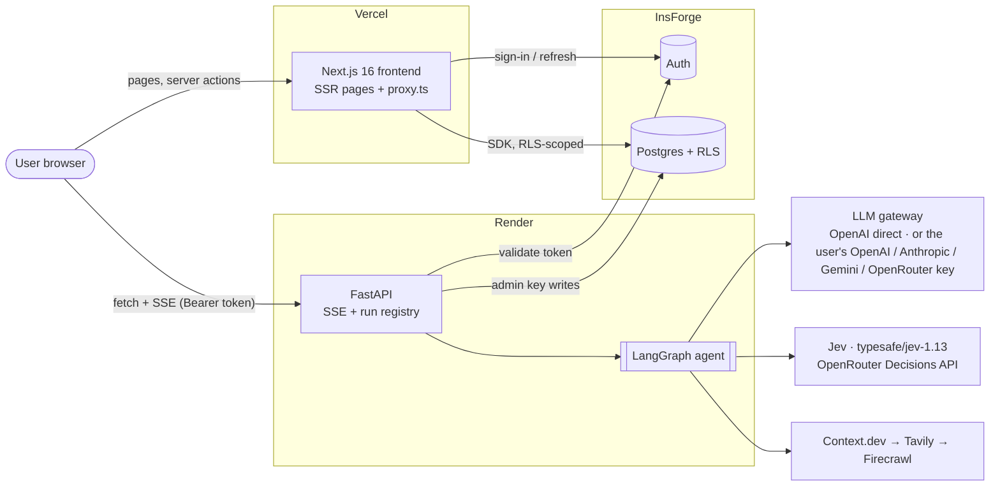
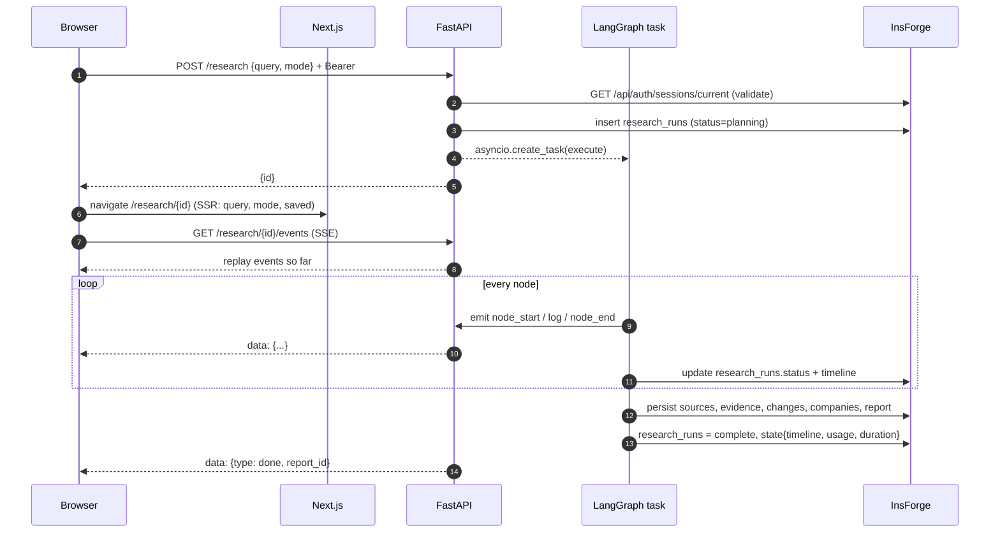
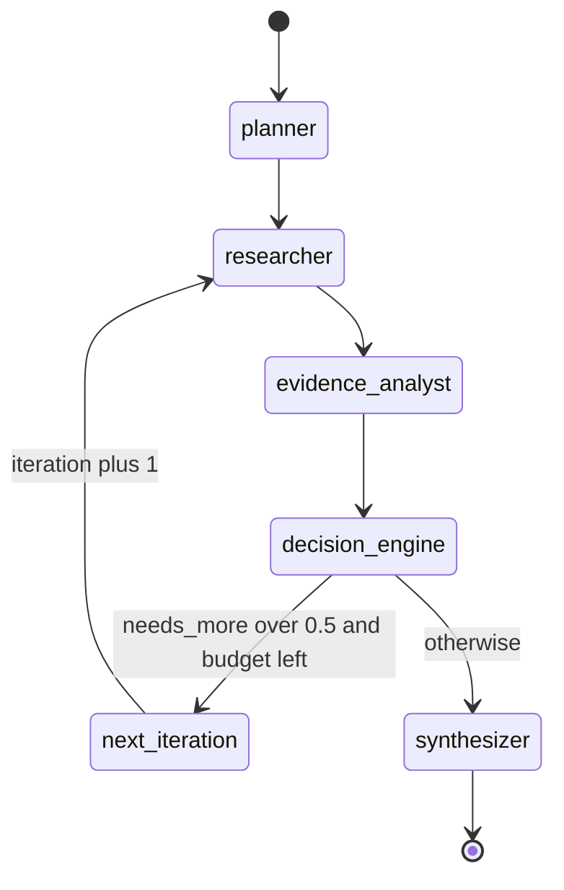
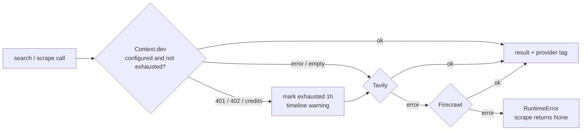
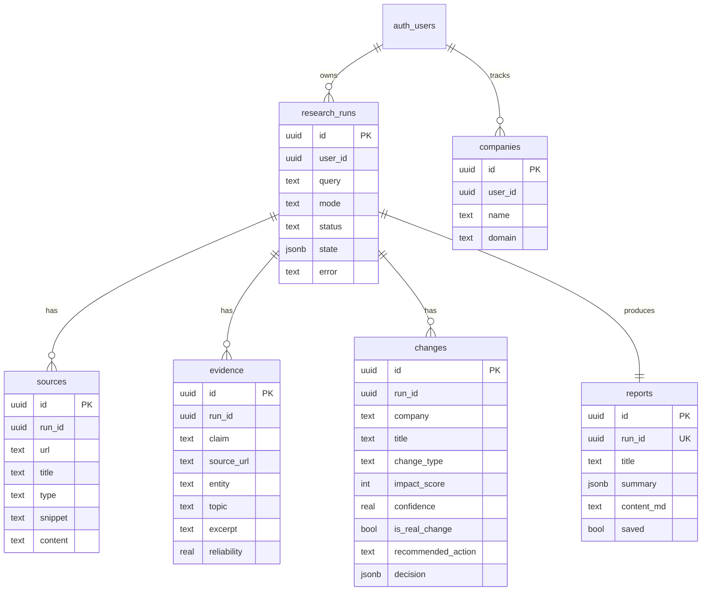
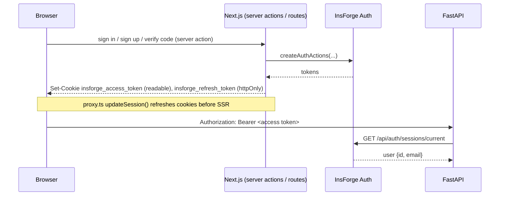
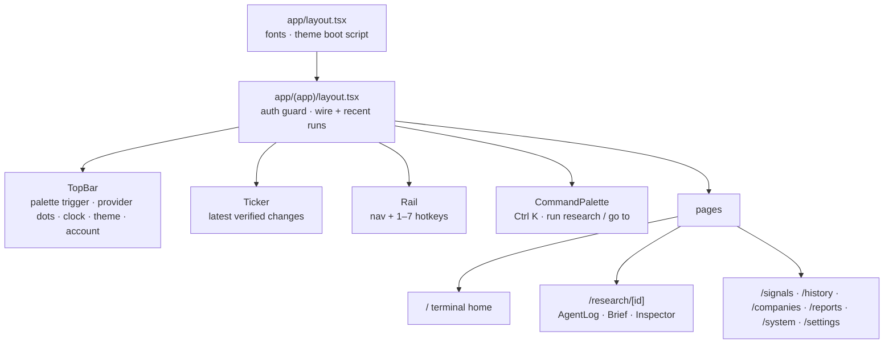
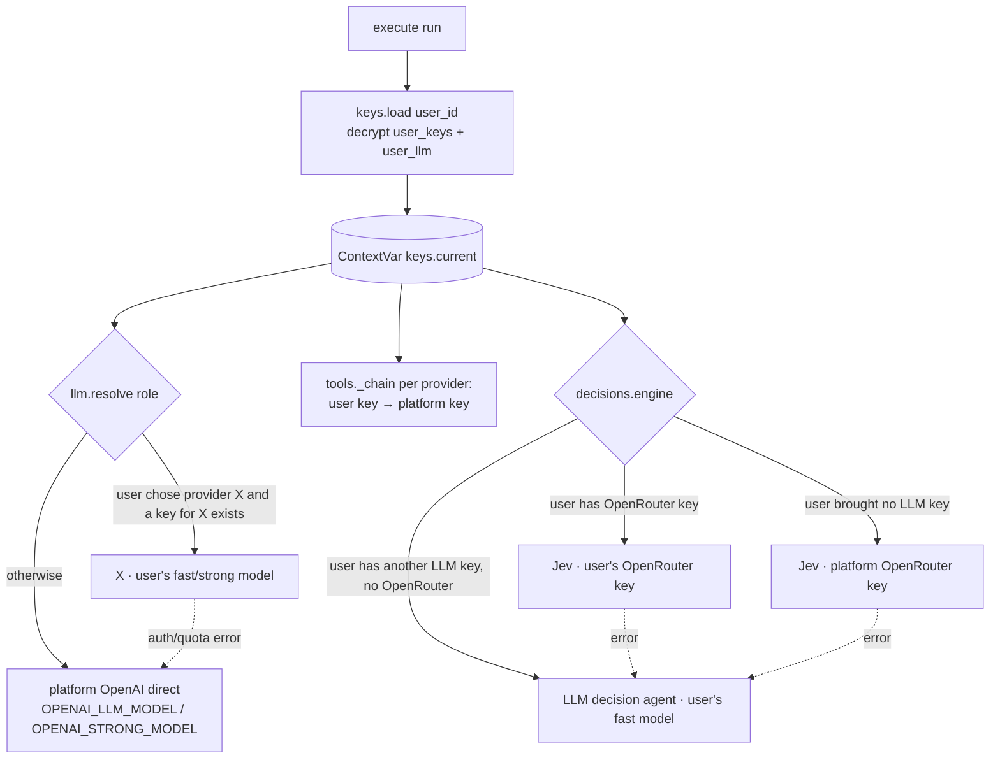

# Architecture

This document describes the system **as built**. The concept images in this folder (`01_arch.png` to `08_arch.png`, `project_architecture.png`, `project_dashboard.png`) are the original design. [§11](#11-from-concept-to-build) maps each one to what changed.

- [1. System context](#1-system-context)
- [2. Request lifecycle](#2-request-lifecycle)
- [3. LangGraph workflow](#3-langgraph-workflow)
- [4. Jev decisions](#4-jev-decisions)
- [5. Web data and fallback](#5-web-data-and-fallback)
- [6. Data model](#6-data-model)
- [7. Authentication](#7-authentication)
- [8. Monitoring](#8-monitoring)
- [9. Frontend](#9-frontend)
- [10. Deployment and limits](#10-deployment-and-limits)
- [11. From concept to build](#11-from-concept-to-build)
- [12. LLM and key gateway (BYOK)](#12-llm-and-key-gateway-byok)

---

## 1. System context

The browser talks to **two** backends:
- **Next.js server** for page rendering and reads. Server Components query InsForge with the user's own token, so row-level security (RLS) applies.
- **FastAPI**, called directly from the browser, to start runs and stream progress. Streaming doesn't go through Vercel functions, so Vercel's function timeouts never cut off a 2-minute run.

## 2. Request lifecycle

- **Replay:** the SSE endpoint first sends every event the run has produced so far, then follows live. After a restart it rebuilds the run from `research_runs.state.timeline`. A run that was mid-flight gets an "interrupted" error event.
- **Token refresh:** `lib/api.ts` retries a 401 once, after `POST /api/auth/refresh`, which rotates the httpOnly refresh cookie.
- **Payload size:** `slim()` strips full page bodies from `sources` before events reach the browser. Bodies are kept only in the `sources.content` column.

## 3. LangGraph workflow

`budget` is `MAX_ITERATIONS` (2) in every mode except `web`, where it is 0. The loop always ends: `needs_more` is only asked while budget remains.

| Node | Model / tool | Reads | Writes |
|---|---|---|---|
| `planner` | OpenAI → `Plan` | `user_request`, `mode`, `playbook` | `entities[]`, `research_plan[]` (≤6 tasks, or ≤8 for a non-brief playbook: topic, query, include_domains, freshness), `iteration=0` |
| `researcher` | `tools.search` + `tools.scrape` | plan (iteration 0) or `research_gaps` | appends up to 5 new sources per task; the top 2 are crawled (`SCRAPES_PER_TASK`) |
| `evidence_analyst` | OpenAI → `EvidenceSet` | all sources (≤8k chars each, 90k total) | `evidence[]`, `changes[]` (≤8), `contradictions[]`, `research_gaps[]` (≤3) |
| `decision_engine` | `decisions.decide` ×(changes + 1): Jev or the LLM decision agent | changes + their claims | per change `decision`, `is_real_change`, `confidence`, `impact_score`, `evidence_quality`, `change_type`, `affected`, `recommended_action`; `decisions.needs_more_research` |
| `synthesizer` | OpenAI → `Report`, then the playbook schema | changes, evidence, sources | `report` (title, summary, highlights, key_changes, why_it_matters, actions, markdown), plus `report.deliverable` for a non-brief playbook |

**Playbooks** (`app/playbooks.py`) change what a run produces without changing the graph. Each schema mirrors the output template of a marketing skill in `.claude/skills`: `profile` follows competitor-profiling, `pricing` follows the pricing-page teardown, and `battlecard` follows the competitors templates. `landscape`, `pain`, `sizing` and `opportunity` are **summary-only** (`company_schema=None`): one strong call over all claims plus a 150k-char page digest, then a `post` function computes the numbers (pain share %, TAM = product of inputs with a >15% mismatch check, opportunity score = demand × (11 − competition)).

- **Deeper research.** A playbook also deepens the research. Compared with the brief it plans up to 8 tasks, keeps 6 sources per task, crawls 4 of them, reads 15k chars per page (220k total), and asks for ≥30 claims. That costs about 40 web credits per run, and the Tavily and Firecrawl fallbacks absorb overflow.
- **Two-stage build.** `build()` makes one strong-model call per company, in parallel, each fed that company's claims and pages from `company_context()`: its own pages plus shared pages that name no other company. A summary call then runs over those results: the comparison matrix, positioning map, cost scenarios, or head-to-head.
- **Output.** The result is `report.deliverable = {playbook, label, data, files}`. `files` holds skill-format markdown (one profile or teardown per company) that the UI offers as downloads next to `data.json`.

- **Methodology.** The synthesizer also writes `report.methodology`, computed without an LLM: counts, providers, source mix, per-topic coverage from the playbook's `coverage` (3 sources = 100%), completeness, gaps and contradictions.

- **Charts and exports.** `frontend/lib/report-model.ts` turns a report into `ChartSpec[]` (`briefCharts`, `deliverableCharts`) and `TableSpec[]` (`tablesFor`). One model feeds the on-screen SVG charts (`components/research/charts.tsx`), the PDF page (`app/report/[id]`: always light, A4 print CSS, `?print=1` opens Save as PDF), the PowerPoint deck (`lib/exports/pptx.ts`, pptxgenjs, native charts) and the Excel workbook (`lib/exports/xlsx.ts`, exceljs). Both builders are loaded with `import()` on click, so they don't add to the page bundle.

`brief` is the default and adds nothing. The frontend renders the deliverable in `components/research/Deliverable.tsx` as a tab next to the change brief, and it tolerates reports saved in older shapes.

Each node is wrapped by `@node(name)`, which emits `node_start` (with its status) and `node_end` (with elapsed time and a state update). Nodes can emit `log` events, and every event is forwarded to SSE.

## 4. Jev decisions

Jev returns typed answers rather than prose. Each detected change is sent to Jev with its supporting claims and any contradictions, and Jev is asked:

| Key | Type | Question | Used as |
|---|---|---|---|
| `is_real` | noul | Real, verified change? | `is_real_change = p ≥ 0.5`; `confidence = p` or `1 − p` |
| `change_type` | choice | pricing / product / model / docs / policy / partnership / other | label + probability bars |
| `impact` | score (5 levels) | negligible → industry-shifting | `impact_score` 0–100 |
| `evidence_quality` | score (5 levels) | none → conclusive official | `evidence_quality` 0–100 |
| `affected` | choice | developers / enterprises / consumers / investors / competitors | label |

A score answer is a probability-weighted level index, so `score_pct` converts it to 0–100 as `score / (levels − 1) × 100`.

`recommend()` then picks an action:

| Condition (checked in order) | Action |
|---|---|
| not a real change | `ignore` |
| confidence < 60 | `investigate` |
| impact > 70 | `alert` |
| impact ≥ 30 | `monitor` |
| otherwise | `ignore` |

A final run-level question, `needs_more` (noul), is asked with the gaps and contradictions as state. It drives the research loop.

## 5. Web data and fallback

- **Search order:** Context.dev, then Tavily, then Firecrawl. **Scrape order:** Context.dev, then Firecrawl, then Tavily's `extract`.
- **Parameter mapping:**

| Parameter | Context.dev | Tavily | Firecrawl |
|---|---|---|---|
| `include_domains` | `include_domains` | `include_domains` | `site:a OR site:b` in the query |
| noise filter | `exclude_domains` (social) | `exclude_domains` | `-site:` operators |
| `freshness` | `freshness` | `time_range` day/week/month/year | `tbs` qdr:d/w/m/y |
| relevance | native high/medium/low | from `score` (≥0.7 high, ≥0.4 medium) | from rank |

- **Breaker:** HTTP 401 or 402, a message containing "credit", or `key_metadata.credits_remaining == 0` marks Context.dev exhausted for `CREDIT_COOLDOWN` (1h). While it is exhausted, calls go straight to the next provider.
- **Visibility:** every result carries `provider`, and the UI shows it as a tag. Context.dev's remaining credits are read from each response.

## 6. Data model

Every table has a `user_id` column.

`research_runs.state` holds:
- `timeline`: every SSE event, used for replay
- `entities` and `plan`
- `decisions`
- `iterations`
- `usage`: per-run provider calls, for example `{"tavily.search": 3, "jev.decide": 5}`
- `duration`

**Access control** (`backend/migrations/001_init.sql`):
- RLS is on for all six tables. The `anon` role has no access.
- `authenticated` users can `SELECT` only rows where `user_id = auth.uid()`.
- Users may update only `reports.saved` (a column-level grant) and manage their own `companies`.
- Everything else is written by the backend with the admin API key.

## 7. Authentication

- **Email sign-up:** InsForge sends a 6-digit code, and `verifyEmail` creates the session.
- **OAuth (Google, GitHub):** uses PKCE. The code verifier is stored in an httpOnly cookie, and `/api/auth/callback` exchanges the `insforge_code`.
- **Guarding pages:** `app/(app)/layout.tsx` calls `currentUser()` and redirects to `/login` when there is no session.

## 8. Monitoring

- **`usage.py` counters** (in process): `{provider}.{op}`, `.fail` and `.fallback`, plus `jev.decide` and `jev.cost_micro`. It also tracks `last_error`, `credits_left` and `exhausted_until`.
- **Per-run usage:** a ContextVar `Counter` is active during `execute()`, and its contents are saved to `research_runs.state.usage`.
- **`GET /system`** returns, for each provider: status (`ok` / `exhausted` / `erroring` / `not_configured`), counters and credits. It also returns the search chain, the active provider, uptime, active runs and the user's last 20 runs.
- **Live balances** come from:
  - OpenRouter: `/api/v1/credits`
  - Firecrawl: `/v2/team/credit-usage`
  - Tavily: `/usage`
  - Context.dev: the last `key_metadata` it returned
- **Tracing:** with `LANGSMITH_TRACING=true`, every graph run is traced as `research`, with mode tags and `{run_id, user_id}` metadata.
- **UI:** the `/system` page refreshes every 15s, and the TopBar provider dots refresh every 30s.

## 9. Frontend

- **Research view.** `useRun(id)` streams events into a reducer (`RunState`):
  - `node_start` adds a step, `log` adds a line to the current step, and `node_end` merges the state update (plan, sources, evidence, changes, report).
  - `ResearchLayout` is pure, which makes it easy to render with fixture data.
  - Below `lg` width, the three panes become tabs.
- **Design system:** a "terminal" look defined as CSS variables in `app/globals.css`, with Tailwind v4 `@theme inline` and `@utility`.

| Token | Dark | Light | Use |
|---|---|---|---|
| `bg` / `panel` / `line` | `#07090c` / `#0c1016` / `#1b2330` | `#f5f4ef` / `#fff` / `#e3e1d8` | surfaces |
| `fg` / `dim` / `faint` | `#d7dee8` / `#9aa5b4` / `#7a8494` | `#0d0f12` / `#4c5261` / `#666b7a` | text (`faint` is kept ≥4.5:1 for WCAG AA) |
| `amber` | `#ffb000` | `#a36400` | accent, focus, brand |
| `up` / `down` | `#20d38a` / `#ff5a5f` | `#0f8a57` / `#d1343b` | verified or low impact / alert or high impact |
| `info` / `violet` | `#4cc3ff` / `#a78bfa` | `#0b73b8` / `#6d4bd8` | web / planner, synthesizer, tags |

- **Type:** JetBrains Mono for data, labels and logs; IBM Plex Sans for prose.
- **Themes:** `data-theme` is `dark`, `light` or `system`. It is saved in `localStorage` and applied before paint.
- **Motion:** all animation respects `prefers-reduced-motion`.

## 10. Deployment and limits

| Concern | Now | When it matters |
|---|---|---|
| Live streams and meters | in memory, **1 Render instance** | Redis pub/sub + a shared counter store before scaling out |
| Token validation | 1 InsForge call per API request | verify the JWT locally with `JWT_PUBLIC_KEY` |
| Web credits | Context.dev free tier 250; each search or scrape costs 1 | the fallback chain absorbs exhaustion; a Web-mode run uses about 18 calls |
| Run cost | Jev about $0.00002 per decision; the LLM is the main cost | set `SCRAPES_PER_TASK` / `MAX_ITERATIONS` lower |
| Interrupted runs | marked as interrupted on replay after a restart | resume from `state` with a LangGraph checkpointer |

## 11. From concept to build

| Concept image | Idea | As built |
|---|---|---|
| `01_arch.png` What are we building | OpenAI + LangGraph + Context.dev + Jev → market intelligence feed | Same agent roles. The feed became the **Signals** table and the home **ticker** |
| `02_arch.png` System architecture | Plan → orchestrate → web data → decisions → output | As drawn. Firebase became **InsForge** |
| `03_arch.png` Why Jev | choice / score / noul → typed JSON → application decisions | §4, with the concept's thresholds implemented in `recommend()` |
| `04_arch.png` Research agent | Planner → source researcher → extractor → evidence builder | `planner`, `researcher` (search + crawl), `evidence_analyst` |
| `05_arch.png` Evidence pipeline | web → fetch → raw docs → extract → verify → verified event | the same pipeline; tables `sources → evidence → changes` |
| `06_arch.png` Agentic loop | Jev "sufficient evidence?", with a research-more loop | `decision_engine` → `next_iteration`, capped at `MAX_ITERATIONS` |
| `07_arch.png` LangGraph state | `IntelligenceState` + Firebase persistence | the same state fields; stored in `research_runs.state` + tables |
| `08_arch.png` / `project_architecture.png` Implementation | Next.js API routes, NextAuth, Firestore | **FastAPI on Render**, **InsForge Auth**, **InsForge Postgres**; Next.js is UI-only on Vercel |
| `project_dashboard.png` Dashboard | light 3-column: steps / report tabs | replaced by the **terminal UI**: agent log / brief / inspector, ⌘K, ticker, dark and light themes |

Additions not in the concepts: the Tavily/Firecrawl fallback with the credit breaker, the System monitoring page, per-run usage, and LangSmith tracing.

## 12. LLM and key gateway (BYOK)

- **Storage:** `migrations/002_user_keys.sql` creates two tables.
  - `user_keys` holds one Fernet-encrypted key per provider (`SECRETS_KEY`) plus a `hint` (the last 4 characters).
  - `user_llm` holds the chosen provider and the fast and strong models.

  RLS is on with no policies and every grant is revoked, so only the backend admin key can read them. The API returns only `provider`, `hint`, `verified` and `updated_at`.
- **Roles:** the *fast* model runs the planner, the evidence analyst and the LLM decision agent. The *strong* model writes the final brief.
- **Validation:** keys are checked on save with a cheap authenticated call (model list, `/key` or `/usage`). A rejected key is not stored. Context.dev has no free check, so its keys are stored as "unverified".
- **Model lists:** the pickers are filled live from each provider's model API, cached for 10 minutes. An OpenRouter key lists its whole catalog, which covers every vendor's models.
- **LLM decision agent:** it builds a pydantic schema from the question dict, with one probability field per `noul` / choice option / score level. It then normalises the answers (which also works when a model replies in percent) and emits **Jev-identical** answers, so `recommend()`, `score_pct()` and the UI stay unchanged.
- **Transparency:** `state.models`, `state.decider` and `usage` record which route served each run. The Settings page shows a notice when the LLM agent replaces Jev.

| Endpoint (auth) | Purpose |
|---|---|
| `GET /settings` | keys (hints only), platform availability, model choice, effective routes, decision engine + notice |
| `PUT /settings/keys/{provider}` | validate, encrypt and store |
| `DELETE /settings/keys/{provider}` | remove (also clears a model choice that relied on it) |
| `GET /settings/models/{provider}` | live model list |
| `PUT` / `DELETE /settings/llm` | set or reset the fast and strong models |
